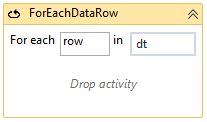
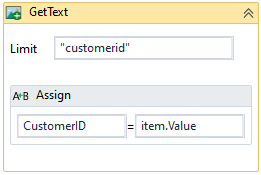
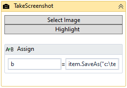
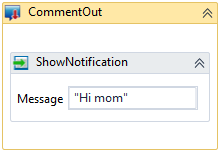
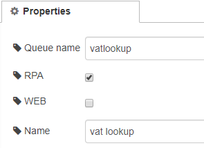
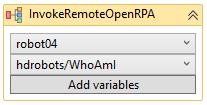
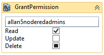

# OpenApplication

**動作:** このアクティビティの基本的なアイデアは、実行中のアプリケーションを確認して、実行中でなければ起動するという動作を簡単にすることです。

現時点で、このアクティビティはWindowsコンポーネント、Internet Explorer、NativeMessaging（chrome/Firefox）をサポートします。

**使用方法:** 実行中のアプリケーション/Webページのいずれかをクリックすると、そのアプリケーションのセレクタが作成されます。

微調整するには、［Open Selector］をクリックして変更を加えます（どの要素を探すかなど）。セレクタが動作しているかテストするには、［Highlight］をクリックします。

［Select element］をクリックするとウィンドウの位置を探し、X、Y（幅と高さ）で保存します。

その後は、呼び出されるたびにウィンドウの位置とサイズを変更します。

**理由:** スタートメニューをクリックしたりファイルを直接開いたりする代わりに使用します。

セレクタにはパラメータなどの詳細が含まれるため、ドキュメントをクリックしてWordを開いた場合にも、セレクタにより検出されます。

# CloseApplication

**動作:** アプリケーションまたはWebページを閉じます。

**使用方法:** 実行中のアプリケーション/Webページのいずれかをクリックすると、そのアプリケーションのセレクタが作成されます。

微調整するには、［Open Selector］をクリックして変更を加えます（どの要素を探すかなど）。セレクタが動作しているかテストするには、［Highlight］をクリックします。

**理由:** ［閉じる］ボタンをクリックする代わりに使用します。

アプリケーションがハングアップした場合や、単にアプリケーションを強制的に終了する効率的な方法が欲しいという場合に便利です。

# HighlightElement

**動作:** 見つかった要素をハイライトします。

**使用方法:** GetElementアクティビティの内側にこれをドラッグしてハイライトさせます。

ワークフローはハイライトしている間も継続されます。ハイライト中にワークフローをブロックするには、Clicking=Trueを設定します。

**理由:** デバッグ用に、またはロボットの実行中にエフェクトを加えたい場合に使用します。

# TypeText

**動作:** 値を割り当てる場合、通常はアイテムのValueプロパティを使用しますが、Keyコンビネーションをアプリケーションに送る必要がある場合には、これが役に立ちます。 

**使用方法:** これを使用する場合はRecord関数の使用を強くお勧めしますが、構文を理解したい方は、こちらで詳細をお読みいただけます。

**理由:** 場合によってはショートカットキーを使用する方が簡単で時間もかかりません。あるいは、要素が入力を正しく受け取れない場合があります。

# ClickElement

**動作:** マウスクリックを表します。デフォルトはバーチャルクリックの使用です。

これはオブジェクトタイプやプロバイダに応じて意味が異なりますが、一般にはマウスを動かさずにクリックすることと考えられます。

VirtualClickをFalseに設定し、実際のマウスクリックを行った後にOffsetX/OffsetYを使用すると、要素内部でのクリックヒットになります（「0,0」は要素の左上隅になります）。

**使用方法:** これを使用する場合はRecord関数の使用を強くお勧めしますが、GetElementアクティビティの中でこれをドラッグする場合は、かならずアイテムにElementプロパティを設定してください。

**理由:** クリックは必要です。ショートカットキーですべて行えるわけではありません。

# GetElement

**動作:** 環境内でアイテムの位置特定に使用する、ロボットの主要ツール。

プロバイダに応じて設定は異なることがありますが、これは一般に、セレクタに基づいて1つまたは多数の要素の位置を特定できます。

微調整にはOpen Selectorを使用します。

デフォルトではアイテムを1つだけ探し、見つかったオブジェクトの件数が1未満の場合にはエラーを発行します。

この動作を変更するには、MaxResultsとMinResultsを使用します。

たとえば、DataSet内をループしたい場合は、DataRowを選択してMaxResultsを100に設定します。

次に、GetElementの内部で新しくGetElementを追加すると、DataRowに応じて異なる要素を「取得」できます。

MinResultsを0に設定すると、実質的にはオブジェクトが存在するかどうかという確認のみを行いますが、何も見つからないという場合でもエラーは発行されません。

**使用方法:** ［Record］を押して要素をクリックすると、ロボットはクリックした要素のタイプを判断して適切なGetElementアクティビティを挿入しようとします。あるいは、自分でドラッグしてOpen Selectorを使用し、関心のある要素を正確に選択できるようにすることもできます。

**理由:** 要素がなければ本物のRPAではありません。

# ForEachDataRow

**動作:** データテーブルまたはデータセットを返してループ処理を行うというアクティビティの多くは、簡単にアクセスできる列挙子がないため、わかりにくいものになりがちです。ここでは 

**使用方法:** テーブル名を入力するだけで、本体内のすべてが行に対して1度呼び出されます。

**理由:** ForEachWithBodyFactoryをセットアップして列挙子を用いてLinqクエリを記述したり、System.Data.DataSetExtensionsネームスペースを追加してAsEnumerable()拡張メソッドにアクセスできるようにしたりするための時間を節約できます。

# GetImage

**動作:** 他の要素に関連するイメージを取得します。

**使用方法:** GetImageをGetElementの内部に置き、見つかったオブジェクトに対して取得位置を選択します。

**理由:** イメージを使用して名前を収集したいとします。プロジェクトでプロパティを開き、フィールドのラベルを探してから、GetImage内でその値のフィールドを選択します。

これで、OCRを使用して簡単に値を取得できるようになります（.ValueはOpenCV  OCRを使用します）。

# GetText

**動作:**  [OpenCV](https://opencv.org/) を使用してイメージからすべてのテキストを取得します。

**使用方法:** GetTextを任意のGetElementまたはGetImageの内部に置くと、gettextはOCRを使用して、［Settings］で選択した言語でテキストをイメージから取得します。

特定の単語または文をフィルタリングするには、WordLimitを設定します。

結果にはそれぞれ座標があり、イメージはelementclickやhighlightなど他のアクティビティから使用されます。

**理由:** 特定の画像を探す代わりに、GetTextを使用して画像内の要素を探すことができます。これは、RDP/Citric/Teamviewerまたはゲーム/ペイントなどでの自動化に便利です。

# LoadFromFile

**動作:** イメージファイルをロードし、ImageElementを返します。

**使用方法:** ファイルを選択してResultをImageElementタイプの変数または本体内の参照アイテムに設定します。

**理由:** 現在画面に表示されているイメージではなく、ファイル内のイメージが必要になることがあります。たとえば、イメージに対してOCRを実行する場合や、何か動的なものを探している場合です。

# TakeScreenshot

**動作:** 画面全体と、画面上の要素または特定領域を画像で記録します。

**使用方法:** この動作はGetImageと同一ですが、GetElementの外部で使用してデスクトップまたは特定領域のイメージを取得する動作もサポートしている点が異なります。

# CommentOut

**動作:** ワークフローの一部をコメントアウトし、実行できないようにします。

**使用方法:** 内部でアクティビティをドラッグ＆ドロップまたはコピー＆ペースト（貼り付け）するか、メニューを右クリックするとワークフローが部分的にコメントアウトされます。

（シーケンス内部でのみ動作します）複数のアクティビティをコメントアウトするには、

アクティビティをマークして［Comment out］を選択します。これにより2件のアクティビティが新しいシーケンスに移動します。これは後から「コメント解除」できます。

**理由:** ワークフローの一部を保存したいが実行はしたくないという場合に便利です。

# CopyClipboard

**動作:** ユーザーのクリップボードの内容（イメージまたは文字列コンテンツ）をコピーします。

**使用方法:** 中にドロップするだけで内容がコピーされます。

「SendCtrlC」を設定すると、現在マークしているものがコピーされます。

**理由:** 要素から直接読み取るよりも、クリップボードを使用してコピーする方が便利な場合があります。たとえば、RDP/Citrix/Teamviewerを通じて自動化するような場合です。

# InsertClipboard

**動作:** テキスト文字列をユーザーのクリップボードに挿入します。

**使用方法:** 中にドロップしてTextでテキストを設定します。

# MoveMouse

**動作:** マウスを特定の位置に移動します。

**使用方法:** GetElementの内部で使用するとOffsetX、OffsetYはそのアイテムに対する相対位置になります。また可変のアイテムを削除すると、OffsetX、OffsetYはデスクトップ1に置かれます。

**理由:** ひとつの例として、メニューをマウスオーバーのみで開き、クリックでは開かないという使い方があります。

# Detector

**動作:** デテクターのトリガーがかかるまでワークフローを待機させます。

**使用方法:** ワークフローの上にドラッグして、ドロップダウンメニューからデテクターを選択します。

ワークフローの実行中にこのアクティビティに到達すると、ワークフローはアイドル状態になり、選択されたデテクターのトリガーがかかるまで待機状態になります

（状態は保存されるので、ロボットまたはマシンが再起動された場合、ワークフローはこのアクティビティから継続されます）。

**理由:** これは、環境内にあるものに対してワークフローを反応させたいという場合に優れた方法です。

ユーザーがキーボードで特定の組み合わせのキーを押した時にフォームへの入力を補助するワークフローを作成できます。また、ユーザーがTimesheetを開いた時にヘルプダイアログを表示できます。また、既存のボタンに動作を追加したいという場合もあるでしょう。

アクティビティが作成されるとすぐに、すべてのアクションがOpenFlowにも送られるという点に注意してください。

OpenFlowを使用すると、トリガーに基づいて他のロボットのトリガーをかける（または2000種類を超えるサポート対象のシステムのいずれかと対話動作をする）ことができます。

# InvokeOpenFlow

**動作:** OpenFlow内部でワークフローを呼び出します。

**使用方法:** OpenFlowの内部にワークフローノードを挿入し、RPAをチェックしてロボットから見える状態にして、［deploy］をクリックします。

これで、OpenRPA内のInvokeOpenFlowアクティビティの内部で、このワークフローを選択できるようになります。

ワークフロー内の変数はすべてmsg.payload内のワークフローに送られ、msg.payload内のデータはすべて、完了後にロボットに送り返されます（対応する変数が存在する場合）。

**理由:** 使いやすいドラッグ＆ドロップワークフローエンジンを使用して、他のロボットおよび2000を超える他のロボットにアクセスできるようにすることで、RPAワークフローの可能性を大幅に高めます。

# InvokeOpenRPA

**動作:** OpenRPA内で他のワークフローを呼び出します。

**使用方法:** InvokeOpenRPA内にドラッグして、呼び出したいワークフローを選択します。

ターゲットとされるワークフロー内の引数はすべて同じ名前のローカル変数にマッピングされるため、2件のワークフローの間でパラメータの転送がサポートされます。

［Add variable］をクリックすると、目的のワークフロー内にある入出力引数はすべて、現在のスコープ/シーケンス内にローカルに作成されます。

**理由:** ワークフローが複雑になると、小規模の「チャンク」に分割してお互いに呼び出せるようにした方が管理しやすくなります。

また、複数の小規模なワークフローがあると、OpenFlowを使用してワークフローの各パートで統計を実行するためのアクセスも簡単になります。

# InvokeRemoteOpenRPA

**動作:** リモートのロボットまたはロボットのグループでワークフローを呼び出します。

**使用方法:** リクエストを送りたいロボットまたはロールを選択すると、ワークフローのリストは、ロボットまたはロールにアクセス権がある対象のみに限定されます。

ワークフローが引数を取得する、または返す場合、［Add  variables］をクリックすると、それぞれに対する変数が現在のシーケンスに追加されます。

**理由:** OpenFlowワークフローを追加してロボットの呼び出しを処理するよりも簡単です。

複数のロボットを処理する場合はOpenFlowを使用する方が安全ですが、複数のマシン上で何かを実行するためには、より速く簡単な方法があっても良いでしょう。

# InsertOne

**動作:** 任意のオブジェクトを取得し、Jsonドキュメントに変換し、OpenFlowインスタンスに接続されている場合はデータベースに保存します。

**使用方法:** アイテム内に保存するオブジェクトを設定し、Typeフィールドを使用するドキュメントタイプをオーバーライドし、Encrypt  Fieldsを使用して、ドキュメント内のどの要素をEAS  256bit暗号化方式で暗号化するかを定義します。

結果には挿入結果が含まれます。

**理由:** ドメイン/複数のロボットを渡るデータの保存や処理を簡単に行える方法、または便利なデータベースとして使用できます。

# InsertOrUpdateOne

**動作:** 任意のオブジェクトを取得し、Jsonドキュメントに変換し、OpenFlowインスタンスに接続されている場合はデータベースに保存します。

**使用方法:** 動作はInsertOneと同じです。

Uniquenessを使用すると、挿入または更新する際に、一意に定まる独自の制限を定義できます。

「department」プロパティを持つオブジェクトがあり、すべての部門（department）に一意に定まる名前があるとします。オブジェクトがすでに存在しているかを手動でテストしなくても、InsertOrUpdateを使用してタイプを「department」、Uniquenessを「department,_type」に設定することができます（タイプは「_type」としてデータベースに保存されます）。

Uniquenessが使用できない場合、「_id」を使用するデフォルトの制限が使用されます。

**理由:** ドメイン/複数のロボットを渡るデータの保存や処理を簡単に行える方法、または便利なデータベースとして使用できます。

# DeleteOne

**動作:** OpenFlowのデータベースからドキュメントを削除します。

**使用方法:** オブジェクトをアイテムまたは「_id」のIDで指定します。

**理由:** ドメイン/複数のロボットを渡るデータの保存や処理を簡単に行える方法、または便利なデータベースとして使用できます。

# Query

**動作:** OpenFlowのデータベースを検索します。

**使用方法:** [QueryString](https://docs.mongodb.com/manual/tutorial/query-documents)内にMongoDBクエリを指定し、結果をJObjectsの配列として取得します。

**理由:** ドメイン/複数のロボットを渡るデータの保存や処理を簡単に行える方法、または便利なデータベースとして使用できます。

# GrantPermission

**動作:** ユーザーまたはグループに対して、オブジェクトへの許可を付与します。

**使用方法:** 結果として生じるJObjectを他のアクティビティのいずれかから使用すると、「_acl」プロパティを更新して、特定のユーザーまたはグループに対して、指定された許可セット（ユーザー/グループに対して読み取り/更新/削除の許可を設定、無視または削除する）が確実に付与されるようにすることができます。

この後、InsertOrUpdateOneを使用して変更を保存する必要があります。

**理由:** ドメイン/複数のロボットを渡るデータの保存や処理を簡単に行える方法、または便利なデータベースとして使用できます。

# RemovePermission

**動作:** ユーザーまたはグループから、オブジェクトへの許可を削除します。

**使用方法:** 特定のユーザーまたはグループに対して、指定されたJObjectの許可を完全に削除します。

**理由:** ドメイン/複数のロボットを渡るデータの保存や処理を簡単に行える方法、または便利なデータベースとして使用できます。

# SaveFile

**動作:** OpenFlowのデータベースの[GridFS](https://docs.mongodb.com/manual/core/gridfs/)にファイルをアップロードします。

**使用方法:** OpenFlowにファイルをアップロードします。GetFileを使用して再度ダウンロードし、InsertOrUpdateOneを使用して更新し、RemoveOneを使用して削除できます。

**理由:** ドメイン/複数のロボットを渡るデータの保存や処理を簡単に行える方法、または便利なデータベースとして使用できます。

# GetFile

**動作:** OpenFlowのデータベースに保存された[GridFS](https://docs.mongodb.com/manual/core/gridfs/)からファイルをダウンロードします。 

**使用方法:** _idを使用してファイルを再度ダウンロードするか、またはファイル名に基づいて最新バージョンを取得します（ユーザーにアクセス権がある場合）。

**理由:** ドメイン/複数のロボットを渡るデータの保存や処理を簡単に行える方法、または便利なデータベースとして使用できます。

# SetCredentials

**動作:** ユーザー名とパスワードを名前とともに保存します。

**使用方法:** 認証セットの名前を検索し、ユーザー名とパスワードを設定します。

**理由:** 認証情報をロボットから更新するためのアクセスが容易になります。

**動作:** 名前を用いていOpenFlowから認証情報を取得します。

**使用方法:** 名前を設定し、ユーザー名とパスワードを変数内に保存します。SecureStringが使用できない場合、代わりにUnsecurePasswordを使用すると、パスワードは文字列変数に保存されます。

**理由:** ユーザー名とパスワードをワークフロー内に保存するのは良い方法ではありません。ユーザー名とパスワードが暗号化されるOpenFlow内部に保存する方が安全です。

# SetAutoLogin

**動作:** 現在のコンピュータの自動ログイン情報を設定します。

**使用方法:** これは、ロボットが管理者権限で実行されている場合にのみ動作します。

次の再起動で、コンピュータは指定された認証情報を用いて強制的に自動ログインします。

カウントを0に設定すると継続して使用できます。

**理由:** これは、ユーザー名とパスワードを平文でレジストリに設定するよりも良い代替方法をです。このアクティビティはパスワードをローカルのlsaStoreに保存します。

# ReadCell

**動作:** Excelスプレッドシートのセルを1個読み取ります。

データのタイプは、［ArgumentType］ドロップダウンリストで選択します。

**使用方法:** Excel内でクリックするか手動でワークフロー内にドラッグする際に、ESCキーを押すことで記録を追加できます。

読み取っているデータのタイプを選択し、読み取り元になるセルをCellプロパティで選択し（たとえば「A2」など）、Resultプロパティに受け取る変数を設定します。

Excelが正しいシートから強制的に読み取るようにするには、ワークシートプロパティも設定します。

**理由:** 従来のRPA技術では、Microsoft Excelなど実行時に大量のUI操作を行うアプリケーションを使用することが困難であるため、Office COMインターフェイスを使用する方が便利です。

また、数式や値の読み取りなどのオプションも多くなっています。

# WriteCell

**動作:** Excelスプレッドシートに値を書き込みます。

データのタイプは、［ArgumentType］ドロップダウンリストで選択します。

**使用方法:** Excel内でクリックするか、または手動でワークフロー内にドラッグする際に入力ダイアログに値を入力することで、記録を追加できます。

読み取っているデータのタイプを選択し、書き込み先になるセルをCellプロパティで選択し（たとえば「A2」など）、Valueプロパティに受け取る値/変数を設定します。

Excelが正しいシートから強制的に読み取るようにするには、ワークシートプロパティも設定します。

値を追加するだけでなくExcelでフィールドの計算を行う場合は、Formulaを使用します。

**理由:** 従来のRPA技術では、Microsoft Excelなど実行時に大量のUI操作を行うアプリケーションを使用することが困難であるため、Office COMインターフェイスを使用する方が便利です。

また、数式や値の読み取りなどのオプションも多くなっています。

# ReadRange

**動作:** 複数のセルまたはシート全体をDataTableに読み込みます。

LastUsedColumnおよびLastUsedRowを使用して次の空セルを簡単に探すためにも使用できます。

**使用方法:** ReadRangeをドラッグし、スプレッドシートを選択して開きます。

特定のシートを強制するには、Worksheetプロパティに入力します。

読み込む範囲をCellsプロパティで設定し、受け取るプロパティを「DataTable」プロパティで設定します。

**理由:** 従来のRPA技術では、Microsoft Excelなど実行時に大量のUI操作を行うアプリケーションを使用することが困難であるため、Office COMインターフェイスを使用する方が便利です。

また、数式や値の読み取りなどのオプションも多くなっています。

# CloseWorkbook

**動作:** Excel内でワークブックを開いている場合は閉じます。

**使用方法:** ファイルを選択し、そのファイルが現在開いていれば閉じます。そのワークブックが読み取り専用でない場合、変更は保存されます。

**理由:** 従来のRPA技術では、Microsoft Excelなど実行時に大量のUI操作を行うアプリケーションを使用することが困難であるため、Office COMインターフェイスを使用する方が便利です。

また、数式や値の読み取りなどのオプションも多くなっています。

# GetEmails

**動作:** 実行中のOutlookでフォルダからEメールを取得します。

**使用方法:** ドロップダウンメニュー内でフォルダを選択し、新規のEメールのみを処理する場合はUnreadOnlyをセットします。

**理由:** 従来のRPA技術では、Microsoft Excelなど実行時に大量のUI操作を行うアプリケーションを使用することが困難であるため、Office COMインターフェイスを使用する方が便利です。

また、数式や値の読み取りなどのオプションも多くなっています。

# NewEmailItem

**動作:** Outlookを使用して、新規Eメールを開いて送信します。

**使用方法:** 現在実行中のOutlookセッションを使用して新規Eメールを開き、UIActionが「Send」に設定されている場合は送信します。UIActionが「Show  and wait」に設定されている場合は、ユーザーがそのEメールを送信/キャンセルまたは保存するまで待機します。

**理由:** 従来のRPA技術では、Microsoft Excelなど実行時に大量のUI操作を行うアプリケーションを使用することが困難であるため、Office COMインターフェイスを使用する方が便利です。

また、数式や値の読み取りなどのオプションも多くなっています。

# CommentOut

**動作: **CommentOutは、ワークフローの一部を簡単に削除できるようにします。

CommentOutの内部に記述したものは何も実行されません。

**使用方法:** アクティビティをこのアクティビティにドラッグ＆ドロップするか、またはコピー＆ペーストするだけです。

近日中に右クリックオプションを実装する予定です。これにより、コメントアウトされたコードの追加や削除がさらにスピードアップされます。

**理由:** デバッグ中に、ワークフローの一部を少しだけ削除できると便利です。また、テンプレートにも使用できます。

# CopyClipboard

**動作:** クリップボード内にあるものをすべてコピーし、SendCtrlCをtrueに設定すると、現在選択されているものがすべて取得されます。

**使用方法:** テキストまたはイメージをコピーまたはマーキングした後、このアクティビティを挿入すると、StringResultまたはImageResultで結果が得られます。

**理由:** コピー＆ペーストを使用する方が便利な時もあります。Remote  DesktopやCitrixを使用して自動化するなどにはこれがベストな方法です。OCRは常に信頼できるとは限らないので、コピー＆ペーストを使用する方が良いでしょう。

# InsertClipboard

**動作:** テキストをクリップボードに追加して貼り付けられるようにします。

**使用方法:** テキストをText Propertyに割り当ててください。

**理由:** 理由はわかりませんが、CopyClipboardを作成した後、これが正しいような気がしました。

テキストを追加したい場合に、ユーザーはどこに挿入するかを決定できます。

# OpenURL

**動作:** これは、OpenApplicationとほぼ同じですが、Internet Explorerのみをサポートするという点が異なります。

**使用方法:** ［Get current］をクリックすると、最初に見つかったブラウザのアクティブなタブのURLを自動的に取得します。

**理由:** よくわかりません。今のところはOpenApplicationで十分だと思います。

# ShowNotification

**動作:** 画面の右下の通知領域に短いメッセージを表示します。

**使用方法:** Messageを設定して通知タイプを選択します。

**理由:** ワークフローのステータスに関してユーザーフィードバックを送るために便利です。

# InvokeForm

**動作:** ユーザーにフィードバックを求めるフォームを表示します。

**使用方法:** ［Open designer］をクリックしてワークフローをデザインする場合、[Forge Forms](https://wpf-forge.github.io/Forge.Forms/)の構文に関する情報がさらに得られます。  

フォーム内の名前に一致する変数はすべてそのフィールドにバインドされるので、変数に値がある場合はフォームに表示されます。ユーザーがフォームを閉じると、挿入された値は変数にマッピングされます。

正しいタイプの変数を簡単に作成するには、Designerでフォームをデザインした後に［Create variables］をクリックします。

Result.Actionにはユーザーが押したボタンの名前が含まれ、キャンセルされた場合はnull/Nothingが入ります。

**理由:** ワークフロー内でユーザーが操作する部分を作成する場合に便利です。

# InvokeCode

**動作:** 数種類の異なる言語でコードを記述できます。

**使用方法:** アクティビティ内にドロップして［Open Editor］をクリックします。

これにより、現在インポートされているネームスペースのリストがコピーされて保存されます（コードを実行する際に使用されます）。

使用する言語をドロップダウンリストで選択します。VBまたはC#を選択すると、コードを記述する際にIntelliSenseも使用できます。

コードの実行でエラーが生じた場合には行番号が通知されます。コード内で同じ行を探す場合は、タイトルに表示されている行数を引き算する必要があります。

つまり、行32にエラーがあり、タイトルで20行追加となっている場合、エラーのある行は12になります。

**理由:** ワークフローは便利ですが、使い慣れた言語で数行を記述する方が効率や快適さの点で優れている場合もあります。

# DownloadFile

**動作:** ファイルをローカルマシンにダウンロードします。

**使用方法:** URLを設定して、保存するフォルダとファイル名を選択します。

# ReadExcel

**動作:** ExcelまたはCSVファイルを読み込み、すべてのデータを含むデータセットを返します。 

**使用方法:** ファイル名を指定し、先頭行をヘッダーとするかどうかを設定し、DataSet変数を設定します。

Excelファイルを読み込む場合、各ワークシートがそれぞれ新規テーブルとして追加されます。

ForEachDataRowを使用すると、.table(0)を用いてデータ内をループすることができます。複数のワークシートがある場合は、.table(“Sheet1”)などのように、名前でテーブルを取得することもできます。

**理由:** 使用するコンピュータにOfficeの新しいバージョンがインストールされていない場合や、データを読み取る際にExcelを開いておきたくない場合に便利です。

# WriteExcel

**動作:** データテーブルまたはデータセットを新しいExcelファイルに書き込みます。

**使用方法:** ファイル名とデータテーブルまたはデータセットを指定します。

これはファイルを上書きし、計算やフォーマットはすべて削除されます。

ヘッダーを含めるには、include headerをtrueに設定します。

組み込まれているテーマを選択すると、データのフォーマットが少し改善されます。

**理由:** 新しいバージョンのOfficeがインストールされていない場合、またはレイアウトや数式を気にしない場合に、良い代替方法となります。

# ReadJSON

**動作:** シンプルなJSON構造または配列を読み取り、解析しやすいデータテーブルにします。

**使用方法:**JSONファイルとデータベース変数を用意し、ForEachDataRowを使用して内部をループさせます。

**理由:** JObject/JArrayを作成して自分で解析する代わりに使用できます。

# ReadPDF

**動作:** PDFファイルを読み取ります。

**使用方法:** PDFファイルを用意し、すべてのテキストを文字列として取得するか、または[PDFReader](https://api.itextpdf.com/iText5/5.5.11/com/itextpdf/text/pdf/PdfReader.html)オブジェクトを使用して解析します。  

**理由:** ベーシックなPDF読み取りを行うシンプルなソリューションです。さらに詳細な解析には[AWS Textract](https://aws.amazon.com/textract/)やその類似サービスを使用します。また、請求書の解析には[Abby](https://www.abbyy.com/en-eu/solutions/accounts-payable-automation)、[Rossum](https://rossum.ai/)、その他類似のサービスを使用します。