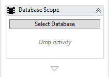
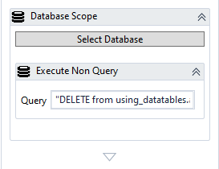
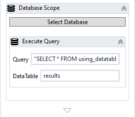
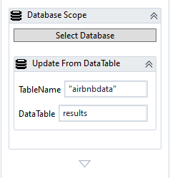

### OpenRPA.Database

#### OpenRPA.Database Database Scope

Selects the database that will be used to query, insert, update, or delete data by opening a connection and ending it once all the activities inside its scope are concluded. A thorough example is shown in the OpenRPA.Database Activities, DataTable, DataView section.

**Properties Parameters**

- `ConnectionString` - The [ConnectionString](https://docs.microsoft.com/en-us/dotnet/api/system.data.sqlclient.sqlconnection.connectionstring?view=dotnet-plat-ext-3.1) which will be used to connect to the database.
- `DataProvider` - The provider used for the given database. Default for MySQL is "MySql.Data.MySqlClient".
- `DataSource` - The name of the database schema that will be used to gather data from.
- `DisplayName` - Title of the Activity inside the sequence.
- `Timeout` - Time to wait until the connection is completed.

#### OpenRPA.Database Execute Non Query

Runs a query that returns no results, useful for `INSERT`, `UPDATE`, and `DELETE` statements. The `Result` value is the number of rows affected by the command.

**Properties Parameters**

- `Query` - The query which will be executed.
- `activity_displayname` - Title of the Activity inside the sequence.
- `CommandType` - Default is set to `Text`.
- `Result` - `Int32` output of the executed query.

#### OpenRPA.Database Execute Query

Runs a query and returns the results as a DataTable. Useful for `SELECT` statements.

**Properties Parameters**

- `Query` - The query which will be executed.
- `activity_displayname` - Title of the Activity inside the sequence.
- `CommandType` - Default is set to `Text`.
- `DataTable` - The `DataTable` object where to save the result of the query.

#### Note on DataTables in OpenRPA

In OpenRPA, a `DataTable` corresponds to a 2-dimensional non-serializable object used to hold values. It is like a matrix with `i` rows and `j` columns. The `i` rows are accessible by using the `.Rows(n)` attribute, and the `j` columns are accessible by using the `.Item(n)` attribute.

#### OpenRPA.Database Execute Scalar

Runs a query that returns exactly one result, such as aggregate functions: `SUM`, `AVG`, `MAX`, `MIN`, and `COUNT`.

**Properties Parameters**

- `Query` - The query which will be executed.
- `activity_displayname` - Title of the Activity inside the sequence.
- `ArgumentType` - Type of the result which will be returned.
- `CommandType` - Default is set to `Text`.
- `Result` - Result output of the executed query.

#### OpenRPA.Database Update from DataTable

Adds in `SQL table` the data contained inside the given `DataTable`.

**Properties**

- `DataTable with the data you want to update from` - Self-explanatory.
- `TableName` - Table to insert rows into.
- `activity_displayname` - Title of the Activity inside the Sequence.
- `Result` - number of rows affected.
