# Detectors

Workflows needs to be activated in some way. And opening the workflow and pressing Play is not always the best solution. Detectors is a way to make the robot serve as a detection probe for OpenFlow and/or as a way of activating Workflow locally on the robot machine. For instance, when implementing Assisted Robotics, where the robot will help a human at the PC, it would make a lot of sense to teach the users that pressing a certain key combination, for instance Ctrl+M will activate a robot sequence that does something, like copying the content of the select field, call an workflow in OpenFlow and insert data in the form, based on the result. Another common detector is the FileWatch detector. Setting op a job that monitors a folder for CSV files, and processes them, once a new one arrives.

## Setting up detector

Pressing Detectors in the toolbar will open a list of detectors you have access too, at the top will be a list of the currently installed detector plugins, clicking one of these will add a new Detector. Select a detector and press the Delete key on your keyboard, to remove a detector. Depending in the detector you will get a list properties and buttons. For instance, the 2 Windows Detectors have a Select button, and the option to finetune the selector by clicking Open Selector.

As soon as the detector is added, it becomes active, and you will be able to listen for Detector events inside OpenFlow, or use the detector in local workflows.

## Using a detetor
There are 2 main uses for detector. Listening for events from OpenFlow to react on robot computer events, or inside running workflows. 

### In OpenRPA
Lets say you created a click detector that reacts on a user clicking the Help menu item in Notepad. Now create a new workflow and add a DoWhile activity and set Condition to true. We want the workflow to run for ever, since the workflow will end once it reaches the end. By keeping the detector and other code inside a never ending loop, we can make sure the workflow keeps running, and triggers every time the detector triggers.

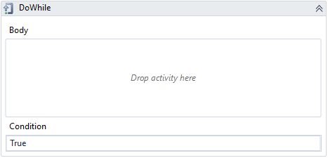

Now, we add the detector activity and select the detector you had just created, and right after that you add a CloseApplication activity. Click "Select"´in the CloseApplication activity and click anywhere in a running notepad, to show, this is the application we want to close.

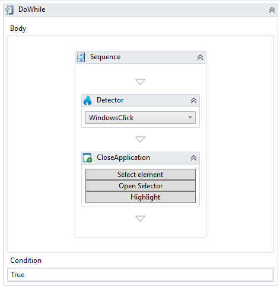

Now press Play, and try clicking the Help menu item and enjoy how helpful this workflow is .

### In NodeRED

Once a detector have been added it will be visible inside OpenFlow. Just drag in a detector node, and select the new detector from the drop down list

Everything that follows will be executes every time the detector is triggered. If permissions on the trigger allows several robots access, all of them will trigger this Node. 
By inspecting msg.payload.data.host or msg.payload.data.user.username you can figure out where the detector was triggered from

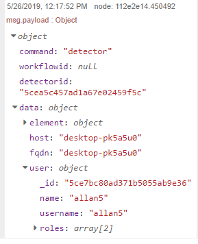

Another way to use detectors is from local workflows. 

## Keyboard detector

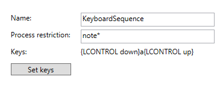

Used to monitor for a sequence of keys. Simply click "set keys" and start pressing the keys in the EXACT sequence you need, when done, press "OK" to set the new sequence. You can limit the detector to only react when focus is on window where process name matches. ( ? and * supported )

## File watch detector

Used to monitor for creation or editing of files in a specific folder. To improve performance and avoid querying the filesystem all the time, it uses file watches, meaning it will only work on the local filesystem, you can limit the search by using file name filter ( ? and * supported)

## Java Click Detector

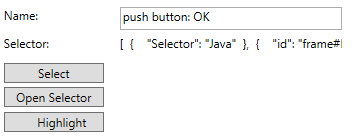

Used to monitor for clicks on Java controls. Click Select to choose an element to detect, use "Open Selector" if you need to fine tune the selector, test everything is working, using the "Highlight" button

## Window Click Detector

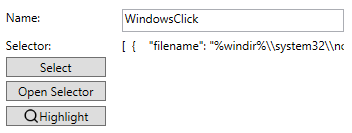

Used to monitor for clicks on Windows controls. Click Select to choose an element to detect, use "Open Selector" if you need to fine tune the selector, test everything is working, using the "Highlight" button.

## Windows Element Detector

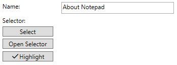

Used to monitor for creation of new Windows controls. This works AFTER an application has started, meaning you can not select an element created doing the application start up. Use it to detect opening new windows, or alert/popups and other elements created after the initial start of the application. Click Select to choose an element to detect, use "Open Selector" if you need to fine tune the selector, test everything is working, using the "Highlight" button.

## Configuring Detectors
To use a **Detector**, you first need to define it in the Detector's settings. Below is an example of configuring the `FileWatcher Detector` for monitoring new `PDF` files:

1. Click on the `Settings` tab in the main ribbon.
   

2. Then, click on the `Detectors` icon.
   

3. Click on `Add FileWatcherDetectorPlugin` button in the Designer. A new detector named `FileWatcher` will appear.
   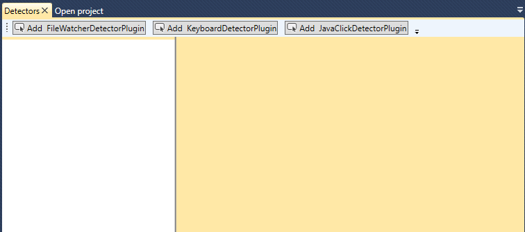

4. Configure the `Name`, `Path`, and `File filter` (e.g., `*.pdf`) for the Detector.
   

For more information on using Detectors, see the [Using Detectors](#using-detectors) section.

## Using Detectors

Detectors in OpenRPA can be used in various ways:

- Through Node-RED to trigger execution flows.
- Inside a `DoWhile Activity` loop with a `Detector Activity`.
- With a `StateMachine Activity` to create different `State Activity` instances triggered by Detectors.

### Using Detectors through Node-RED

For setting up a Node-RED instance, refer to [Accessing Node-RED for the first time](#accessing-node-red-for-the-first-time).

1. Drag an `rpa detector` node to the execution flow.
   

2. Configure the `rpa detector` node to set the Detector.
   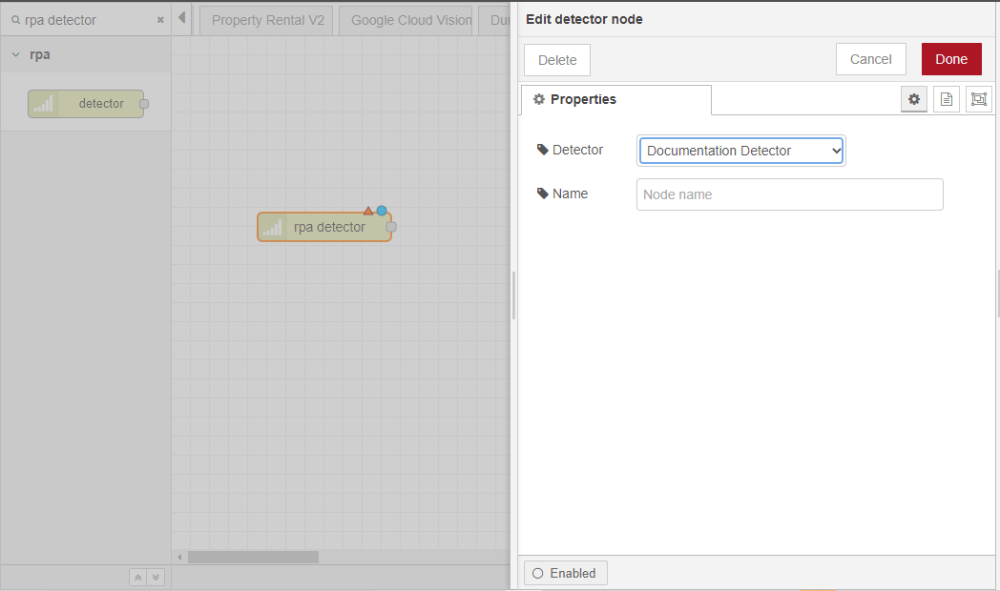

3. Add a `debug` node to the flow.
   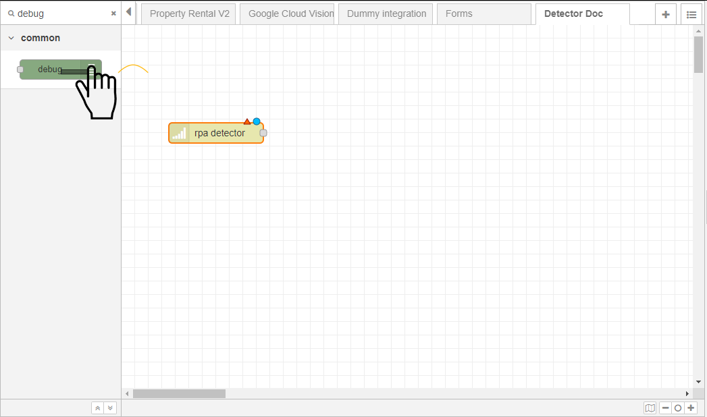

4. Wire the `debug` node to the `rpa detector`.
   

5. Deploy the changes and verify the connection.
   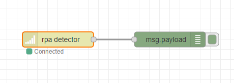

### Using Detectors Through a Do-While Loop

1. Drag a `Do While` Activity to the main sequence in OpenRPA, setting its `Condition` to `True`.
   

2. Add a `Sequence` Activity inside the `Do While` activity.
   

3. Insert a `Detector` Activity within the sequence and select the appropriate Detector.
   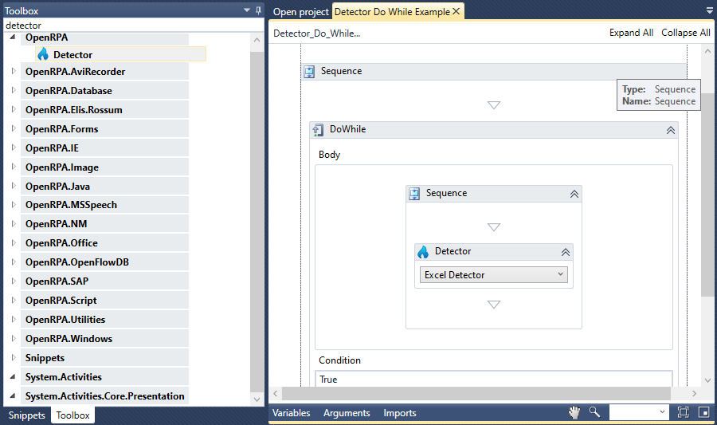

## Specific Detectors in OpenRPA

### FileWatcher Detector

Monitors for new files in a specified folder.

**Parameters:**

- `Name`: Name of the detector in OpenFlow.
- `Path`: Absolute path to the monitored folder.
- `File filter`: Filters files with a specific extension.
- `Sub Directories`: If checked, it also monitors subdirectories.

### Keyboard Detector

Listens for specific keystrokes.

**Parameters:**

- `Name`
- `Process restriction`
- `Keys`

### JavaClick Detector

Listens for clicks within a `JavaElement`.

**Parameters:**

- `Name`
- `Selector`

### MSSpeech Detector

*Coming soon - work in progress!*

### WindowsClick Detector

Listens for clicks within a `WindowsElement`.

**Parameters:**

- `Name`
- `Selector`

### WindowsElement Detector

Listens for the appearance of a `WindowsElement`.

**Parameters:**

- `Name`
- `Selector`